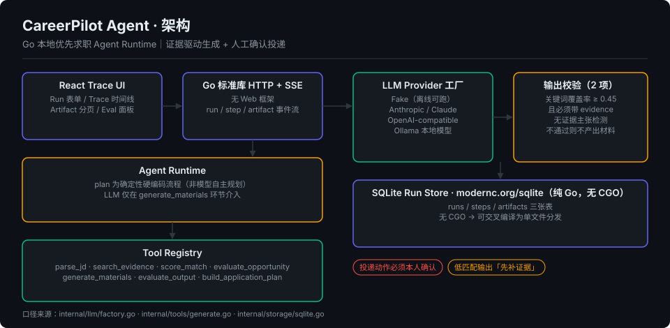

<div align="center">

<h1>CareerPilot Agent</h1>

<p>
  <strong>本地优先、证据驱动、人工确认的求职运营 Agent</strong><br/>
  Go 实现的 Agent Runtime — 工具注册、证据约束生成、SSE Trace、可切换 LLM Provider
</p>

<p>
  
  
  
  
</p>

</div>

---

## 这个项目在解决什么问题

求职材料生成类工具最常见的两个失败模式是：**编造经历**，和**海投一切**。

CareerPilot 明确不是垃圾投递器：系统不会自动提交申请、不会发送邮件、不会伪造经历。
低匹配岗位会输出「不建议投递 / 先补证据」，最终投递动作必须由本人确认。

围绕「岗位导入 → 机会评分 → 候选人证据检索 → 匹配评分 → 材料生成 → 自检评估 → 申请计划 → 投递追踪」
的闭环，展示 Agent 编排、工具调用、可观测 Trace、证据约束生成和负责任自动化。

---

## 架构



几个刻意的设计选择：

| 决策 | 说明 |
|---|---|
| **执行流程确定性编排** | 步骤序列是确定的，LLM 只在 `generate_materials` 环节介入。出问题能定位到具体步骤，而不是「模型抽风了」 |
| **Provider 工厂四路可切** | Fake / Anthropic / OpenAI-compatible / Ollama。Fake Provider 让整条链路在无密钥、无网络时也能跑通，方便演示也方便写测试 |
| **纯 Go SQLite** | `modernc.org/sqlite` 无 CGO，可交叉编译成单文件分发，不需要目标机器装 C 工具链 |
| **无 Web 框架** | 只用 Go 标准库 HTTP + SSE，依赖面尽量小 |
| **证据约束生成** | 材料生成后做 2 项输出校验：关键词覆盖率 ≥ 0.45 且必须带 evidence、无证据主张检测 |

依赖只有两个：`github.com/anthropics/anthropic-sdk-go`（官方 SDK）和 `modernc.org/sqlite`。

---

## 快速开始

环境要求：Go 1.24+；可选 Node.js 20+（前端 Trace UI）。

```bash
git clone https://github.com/galanime/Careerpilot-agent.git
cd Careerpilot-agent

go test ./...
go run ./cmd/server
```

服务监听 `http://127.0.0.1:8788`。前端 Trace UI：

```bash
cd web && npm install && npm run dev
```

无需任何 API Key —— 默认使用 Fake Provider，全链路可离线跑通。

### 可选配置

```bash
export CAREERPILOT_DB_PATH="careerpilot.db"
export CAREERPILOT_OPPORTUNITY_DIR="data/opportunities"
export CAREERPILOT_PIPELINE_PATH="data/pipeline.md"
export CAREERPILOT_REPORTS_DIR="reports"
export CAREERPILOT_EVIDENCE_PATH="data/evidence/projects.yaml"

# fake（默认，离线） | anthropic | openai | ollama
export CAREERPILOT_LLM_PROVIDER="fake"
export CAREERPILOT_LLM_MODEL="..."
export CAREERPILOT_LLM_API_KEY="..."
export CAREERPILOT_LLM_BASE_URL="..."
```

Windows PowerShell 用户把 `export X=Y` 换成 `$env:X = "Y"` 即可。

---

## 工具链

| 工具 | 作用 |
|---|---|
| `parse_jd` | 解析岗位 JD，抽取要求与关键词 |
| `search_evidence` | 从本地知识库检索候选人证据 |
| `score_match` | 岗位与候选人匹配评分 |
| `evaluate_opportunity` | A–G 维度深度评估 |
| `generate_materials` | 生成投递材料（LLM 在此环节介入） |
| `evaluate_output` | 输出自检：关键词覆盖 + 无证据主张检测 |
| `build_application_plan` | 生成申请计划 |

---

## 常用 API

```bash
# 健康检查
curl http://127.0.0.1:8788/healthz

# 导入岗位机会
curl -X POST http://127.0.0.1:8788/api/opportunities \
  -H "Content-Type: application/json" \
  -d '{
    "company_name": "Example Corp",
    "job_title": "AI Agent Engineer Intern",
    "target_role": "AI Agent Engineer",
    "location": "北京",
    "jd_text": "负责 AI Agent 应用开发，要求 Python、Go、Tool Calling、后端工程和评估能力。"
  }'

# 评估岗位（会落盘 reports/*.md 与 data/applications.md）
curl -X POST http://127.0.0.1:8788/api/opportunities/<id>/evaluate

# 订阅实时 Trace
curl -N http://127.0.0.1:8788/api/runs/<run_id>/events
```

<details>
<summary>完整 API Surface</summary>

```text
GET  /healthz
GET  /api/runs
POST /api/runs
GET  /api/runs/{run_id}
GET  /api/runs/{run_id}/artifacts
GET  /api/runs/{run_id}/events        # SSE
GET  /api/opportunities
POST /api/opportunities
GET  /api/opportunities/{id}
POST /api/opportunities/{id}/evaluate
POST /api/opportunities/{id}/status
POST /api/scan                        # 白名单公司岗位扫描
POST /api/liveness                    # 岗位链接有效性检查
```

</details>

---

## 目录结构

```text
careerpilot-agent/
  cmd/server/             HTTP 服务入口
  internal/api/           路由与 handler
  internal/agent/         Agent Runtime 与状态执行
  internal/domain/        Run / Opportunity / Artifact 领域模型
  internal/memory/        本地 evidence store
  internal/opportunities/ 文件型岗位机会库、去重、状态管理
  internal/scanner/       白名单 scanner 与 liveness 检查
  internal/llm/           Fake / Anthropic / OpenAI-compatible / Ollama Provider
  internal/storage/       SQLite Run Store（runs / steps / artifacts 三张表）
  internal/tools/         Tool Registry 与工具实现
  web/                    React Trace UI
  docs/                   PRD、技术设计、使用说明
```

`data/applications.md` 与 `reports/` 为本地投递记录，已 gitignore。

---

## 文档

- [使用说明](docs/USAGE_ZH.md)
- [技术设计](docs/TECH_DESIGN.md)
- [PRD](docs/PRD.md)
- [数据契约](DATA_CONTRACT_ZH.md)
- [方案融合路线图](docs/FUSION_ROADMAP_ZH.md)

## 后续路线

1. A–G 深度报告扩展：级别策略、薪酬需求、面试计划、岗位真实性判定
2. Markdown / HTML / PDF 导出与 ATS 文本层校验
3. Cover letter、邮件草稿与面试故事库
4. 更多 scanner provider：Workday、BambooHR、Teamtailor、RSS
5. SQLite FTS 语义检索

---

## License

MIT © [Hengwei Zhang](https://github.com/galanime)
